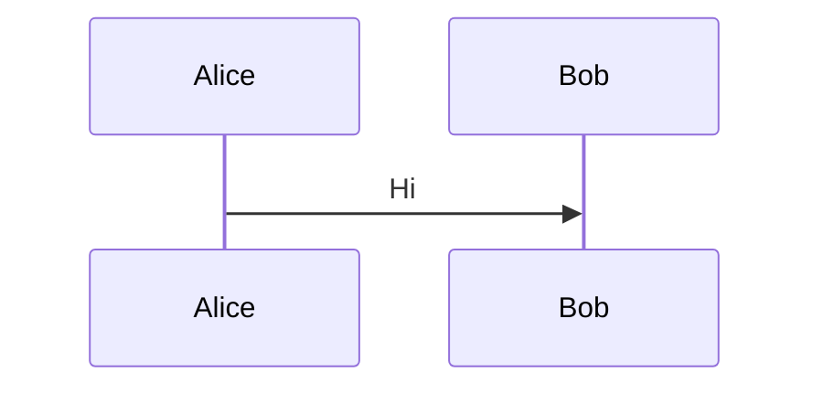
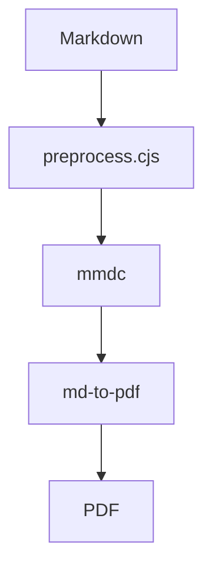
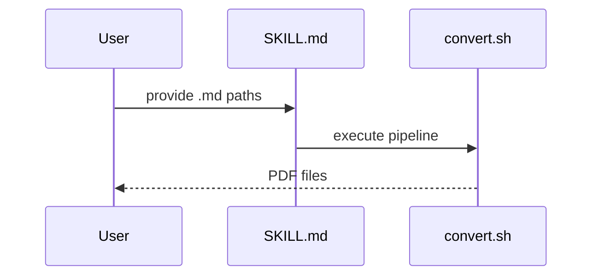

# data-converter Plugin Implementation Plan

> **For agentic workers:** REQUIRED SUB-SKILL: Use superpowers:subagent-driven-development (recommended) or superpowers:executing-plans to implement this plan task-by-task. Steps use checkbox (`- [ ]`) syntax for tracking.

**Goal:** Create the `data-converter` plugin with `md-to-pdf` as its first skill, converting Markdown files (with Mermaid diagrams) to PDF.

**Architecture:** Plugin shell (`plugin.json`) + one skill (`md-to-pdf`). The skill's SKILL.md handles input parsing and delegates to two scripts: `preprocess.cjs` extracts Mermaid blocks into `.mmd` files and rewrites the Markdown with PNG references, `convert.sh` orchestrates the full pipeline (preprocess → mmdc render → md-to-pdf → cleanup).

**Tech Stack:** Node.js (CJS), Bash, `md-to-pdf` (npx), `@mermaid-js/mermaid-cli` (npx)

---

## File Map

| Action | File | Responsibility |
|--------|------|----------------|
| Create | `plugins/data-converter/.claude-plugin/plugin.json` | Plugin metadata |
| Create | `plugins/data-converter/skills/md-to-pdf/SKILL.md` | Skill trigger + flow orchestration |
| Create | `plugins/data-converter/skills/md-to-pdf/scripts/preprocess.cjs` | Extract Mermaid blocks → .mmd, rewrite MD with PNG refs |
| Create | `plugins/data-converter/skills/md-to-pdf/scripts/convert.sh` | Full pipeline: preprocess → render PNG → convert PDF → cleanup |
| Create | `plugins/data-converter/skills/md-to-pdf/references/01-troubleshooting.md` | Known pitfalls and solutions |
| Create | `.claude/skills/md-to-pdf` (symlink) | Local skill testing |
| Create | `.cursor/skills/md-to-pdf` (symlink) | Local skill testing |
| Modify | `.claude-plugin/marketplace.json` | Register data-converter plugin |

---

### Task 1: Plugin scaffold + plugin.json

**Files:**
- Create: `plugins/data-converter/.claude-plugin/plugin.json`

- [ ] **Step 1: Create plugin.json**

```json
{
  "name": "data-converter",
  "version": "1.0.0",
  "description": "資料轉換工具箱，收納各種格式互轉的 skill",
  "author": {
    "name": "Timothy Liao",
    "email": "tim80411@gmail.com"
  },
  "repository": "https://github.com/tim80411/ai-agent-extension",
  "license": "MIT",
  "keywords": ["converter", "markdown", "pdf", "mermaid", "data"]
}
```

- [ ] **Step 2: Commit**

```bash
git add plugins/data-converter/.claude-plugin/plugin.json
git commit -m "feat(data-converter): add plugin scaffold with plugin.json"
```

---

### Task 2: preprocess.cjs

**Files:**
- Create: `plugins/data-converter/skills/md-to-pdf/scripts/preprocess.cjs`

- [ ] **Step 1: Create preprocess.cjs**

```javascript
const fs = require('fs');
const path = require('path');

const srcFile = process.argv[2];
const outMd = process.argv[3];
const imgDir = process.argv[4];

if (!srcFile || !outMd || !imgDir) {
  console.error('Usage: node preprocess.cjs <source.md> <output.md> <imgs-dir>');
  process.exit(1);
}

fs.mkdirSync(imgDir, { recursive: true });
fs.mkdirSync(path.dirname(outMd), { recursive: true });

let content = fs.readFileSync(srcFile, 'utf-8');
const basename = path.basename(srcFile, '.md');
let counter = 0;

content = content.replace(/```mermaid\n([\s\S]*?)```/g, (_match, code) => {
  counter++;
  const id = `mmd-${basename}-${counter}`;
  const mmdFile = path.join(imgDir, `${id}.mmd`);
  fs.writeFileSync(mmdFile, code.trimEnd() + '\n');
  return ``;
});

fs.writeFileSync(outMd, content);
console.log(counter);
```

- [ ] **Step 2: Test manually with a sample markdown file**

Create a temp test file and run:

```bash
mkdir -p /tmp/preprocess-test
cat > /tmp/preprocess-test/sample.md << 'TESTEOF'
# Hello

Some text.


More text.



End.
TESTEOF

node plugins/data-converter/skills/md-to-pdf/scripts/preprocess.cjs \
  /tmp/preprocess-test/sample.md \
  /tmp/preprocess-test/out/sample.md \
  /tmp/preprocess-test/out/imgs
```

Expected stdout: `2`

Verify output:

```bash
cat /tmp/preprocess-test/out/sample.md
# Should contain  and 

ls /tmp/preprocess-test/out/imgs/
# Should contain: mmd-sample-1.mmd  mmd-sample-2.mmd

rm -rf /tmp/preprocess-test
```

- [ ] **Step 3: Test with no-mermaid file**

```bash
mkdir -p /tmp/preprocess-test
cat > /tmp/preprocess-test/plain.md << 'TESTEOF'
# Plain markdown

No mermaid here.

| Col A | Col B |
|-------|-------|
| 1     | 2     |
TESTEOF

node plugins/data-converter/skills/md-to-pdf/scripts/preprocess.cjs \
  /tmp/preprocess-test/plain.md \
  /tmp/preprocess-test/out/plain.md \
  /tmp/preprocess-test/out/imgs
```

Expected stdout: `0`

Verify:

```bash
diff /tmp/preprocess-test/plain.md /tmp/preprocess-test/out/plain.md
# Should be identical

rm -rf /tmp/preprocess-test
```

- [ ] **Step 4: Commit**

```bash
git add plugins/data-converter/skills/md-to-pdf/scripts/preprocess.cjs
git commit -m "feat(data-converter): add preprocess.cjs for Mermaid extraction"
```

---

### Task 3: convert.sh

**Files:**
- Create: `plugins/data-converter/skills/md-to-pdf/scripts/convert.sh`

- [ ] **Step 1: Create convert.sh**

```bash
#!/usr/bin/env bash
set -euo pipefail

if [ $# -eq 0 ]; then
  echo "Usage: convert.sh <md-file-1> [md-file-2] ..." >&2
  exit 1
fi

SCRIPT_DIR="$(cd "$(dirname "$0")" && pwd)"
TMPDIR="/tmp/md2pdf-$(date +%s)"
IMGS_DIR="$TMPDIR/imgs"
mkdir -p "$IMGS_DIR"

HAS_FAILURE=0

for md_file in "$@"; do
  md_file="$(cd "$(dirname "$md_file")" && pwd)/$(basename "$md_file")"
  base="$(basename "$md_file")"
  name="${base%.md}"
  orig_dir="$(dirname "$md_file")"

  # Phase 2: Preprocess Mermaid
  node "$SCRIPT_DIR/preprocess.cjs" "$md_file" "$TMPDIR/$base" "$IMGS_DIR"

  # Phase 3: Render Mermaid PNGs
  mmd_count=0
  for mmd in "$IMGS_DIR"/mmd-"$name"-*.mmd; do
    [ -f "$mmd" ] || continue
    mmd_count=$((mmd_count + 1))
    png="${mmd%.mmd}.png"
    if ! npx --yes -p @mermaid-js/mermaid-cli mmdc -i "$mmd" -o "$png" -b white -w 1400 2>/tmp/md2pdf-mmdc-err.log; then
      echo "FAIL: $md_file - mmdc error: $(cat /tmp/md2pdf-mmdc-err.log)" >&2
      HAS_FAILURE=1
      continue 2
    fi
  done

  # Phase 4: Convert to PDF
  if ! (cd "$TMPDIR" && npx --yes md-to-pdf "$base" 2>/tmp/md2pdf-pdf-err.log); then
    echo "FAIL: $md_file - md-to-pdf error: $(cat /tmp/md2pdf-pdf-err.log)" >&2
    HAS_FAILURE=1
    continue
  fi

  # Move PDF back to original directory
  pdf_file="$TMPDIR/$name.pdf"
  if [ -f "$pdf_file" ]; then
    mv "$pdf_file" "$orig_dir/$name.pdf"
    echo "OK: $orig_dir/$name.pdf"
  else
    echo "FAIL: $md_file - PDF not generated" >&2
    HAS_FAILURE=1
  fi
done

# Phase 5: Cleanup
rm -rf "$TMPDIR"
rm -f /tmp/md2pdf-mmdc-err.log /tmp/md2pdf-pdf-err.log

exit $HAS_FAILURE
```

- [ ] **Step 2: Make executable**

```bash
chmod +x plugins/data-converter/skills/md-to-pdf/scripts/convert.sh
```

- [ ] **Step 3: End-to-end test with a Mermaid markdown file**

Create a test file:

```bash
mkdir -p /tmp/convert-test
cat > /tmp/convert-test/test.md << 'TESTEOF'
# Test Document

A table:

| Name | Value |
|------|-------|
| A    | 1     |
| B    | 2     |

A diagram:


Done.
TESTEOF

bash plugins/data-converter/skills/md-to-pdf/scripts/convert.sh /tmp/convert-test/test.md
```

Expected stdout: `OK: /tmp/convert-test/test.pdf`

Verify:

```bash
ls -la /tmp/convert-test/test.pdf
# Should exist and be non-zero size

rm -rf /tmp/convert-test
```

- [ ] **Step 4: End-to-end test with plain markdown (no Mermaid)**

```bash
mkdir -p /tmp/convert-test
cat > /tmp/convert-test/plain.md << 'TESTEOF'
# Plain

Just text and a table.

| X | Y |
|---|---|
| 1 | 2 |
TESTEOF

bash plugins/data-converter/skills/md-to-pdf/scripts/convert.sh /tmp/convert-test/plain.md
```

Expected stdout: `OK: /tmp/convert-test/plain.pdf`

```bash
ls -la /tmp/convert-test/plain.pdf
rm -rf /tmp/convert-test
```

- [ ] **Step 5: Commit**

```bash
git add plugins/data-converter/skills/md-to-pdf/scripts/convert.sh
git commit -m "feat(data-converter): add convert.sh pipeline script"
```

---

### Task 4: SKILL.md

**Files:**
- Create: `plugins/data-converter/skills/md-to-pdf/SKILL.md`

- [ ] **Step 1: Create SKILL.md**

```markdown
---
name: md-to-pdf
description: >-
  Convert Markdown files to PDF with Mermaid diagram support.
  Use when the user mentions "轉成 PDF", "產生 PDF", "markdown 轉檔",
  "md to pdf", "md-to-pdf", "Markdown 轉 PDF", "把 md 轉成 pdf",
  "convert markdown to pdf", "markdown to pdf", or wants to produce
  a PDF from one or more .md files.
---

# Markdown to PDF

Convert one or more Markdown files to PDF. Supports Mermaid diagrams and Markdown tables.

## Prerequisites

- Node.js v18+

## Workflow

### Phase 1: Parse Input

**Goal:** Identify which .md files to convert.

**Actions:**
1. Extract .md file paths from the user's message
2. Resolve each path to absolute path
3. Verify each file exists using the Read tool
4. If no paths provided, use AskUserQuestion to ask the user which files to convert

### Phase 2-5: Convert

**Goal:** Run the conversion pipeline and report results.

**Actions:**
1. Resolve the script directory relative to this SKILL.md:
   ```
   SKILL_DIR="<directory containing this SKILL.md>"
   ```
2. Execute the pipeline:
   ```bash
   bash "$SKILL_DIR/scripts/convert.sh" <file1.md> [file2.md] ...
   ```
3. Parse stdout for results:
   - Lines starting with `OK:` → successful conversions
   - Lines starting with `FAIL:` → failures (also on stderr)
4. Report results to the user:
   - List each successfully generated PDF path
   - For failures, show the error message and suggest checking
     `references/01-troubleshooting.md` for common fixes (especially Mermaid syntax issues)

## Troubleshooting

If Mermaid rendering fails, common causes are documented in
[references/01-troubleshooting.md](references/01-troubleshooting.md).
The most frequent issue: edge labels containing parentheses must be wrapped in double quotes.
```

- [ ] **Step 2: Commit**

```bash
git add plugins/data-converter/skills/md-to-pdf/SKILL.md
git commit -m "feat(data-converter): add md-to-pdf SKILL.md"
```

---

### Task 5: 01-troubleshooting.md

**Files:**
- Create: `plugins/data-converter/skills/md-to-pdf/references/01-troubleshooting.md`

- [ ] **Step 1: Create 01-troubleshooting.md**

```markdown
# md-to-pdf Troubleshooting

## Mermaid edge label 含括號導致 mmdc 報錯

**症狀：** mmdc 解析失敗，錯誤訊息指向 edge label 語法

**原因：** Mermaid parser 將 `(` 視為 shape 定義的開頭。例如：

```
B -.->|decrypt API (cache miss 時)| KMS
```

**解法：** 將 label 用雙引號包裹：

```
B -.->|"decrypt API (cache miss 時)"| KMS
```

---

## md-to-pdf 直接轉含 Mermaid 的 Markdown → 圖變純文字

**症狀：** PDF 中 Mermaid code block 以程式碼形式顯示，沒有渲染成圖

**原因：** `md-to-pdf` 底層用 puppeteer 將 Markdown → HTML → PDF，但不會執行 Mermaid JS 渲染

**解法：** 使用 `preprocess.cjs` 預處理，將 Mermaid block 抽出並用 `mmdc` 渲染為 PNG，再以圖片引用替換原本的 code block

---

## 預處理為 SVG 後 PDF 中圖片空白

**症狀：** PDF 產出了，但 Mermaid 圖的位置是空白

**原因：** puppeteer 的 `file://` 載入 SVG 有 cross-origin 限制，SVG 圖片被忽略

**解法：** 改用 PNG 格式（`mmdc -o output.png`）而非 SVG

---

## PNG 引用使用絕對路徑導致 PDF 中圖片不顯示

**症狀：** 預處理後的 Markdown 用絕對路徑引用 PNG，但 PDF 中圖片沒有出現

**原因：** md-to-pdf / puppeteer 路徑解析問題

**解法：** 使用相對路徑引用（``），並確保在暫存目錄下執行 md-to-pdf，讓相對路徑能正確對應到 PNG 檔案位置
```

- [ ] **Step 2: Commit**

```bash
git add plugins/data-converter/skills/md-to-pdf/references/01-troubleshooting.md
git commit -m "docs(data-converter): add md-to-pdf troubleshooting reference"
```

---

### Task 6: Symlinks + marketplace.json registration

**Files:**
- Create: `.claude/skills/md-to-pdf` (symlink)
- Create: `.cursor/skills/md-to-pdf` (symlink)
- Modify: `.claude-plugin/marketplace.json`

- [ ] **Step 1: Create symlinks**

```bash
ln -s ../../plugins/data-converter/skills/md-to-pdf .claude/skills/md-to-pdf
ln -s ../../plugins/data-converter/skills/md-to-pdf .cursor/skills/md-to-pdf
```

Verify:

```bash
ls -la .claude/skills/md-to-pdf
# Should point to ../../plugins/data-converter/skills/md-to-pdf

ls -la .cursor/skills/md-to-pdf
# Should point to ../../plugins/data-converter/skills/md-to-pdf
```

- [ ] **Step 2: Add data-converter entry to marketplace.json**

Add this entry to the `plugins` array in `.claude-plugin/marketplace.json`:

```json
{
  "name": "data-converter",
  "source": "./plugins/data-converter",
  "description": "資料轉換工具箱，收納各種格式互轉的 skill",
  "version": "1.0.0",
  "author": {
    "name": "Timothy Liao",
    "email": "tim80411@gmail.com"
  },
  "repository": "https://github.com/tim80411/ai-agent-extension",
  "license": "MIT",
  "category": "development",
  "keywords": ["converter", "markdown", "pdf", "mermaid", "data"],
  "strict": false
}
```

- [ ] **Step 3: Commit**

```bash
git add .claude/skills/md-to-pdf .cursor/skills/md-to-pdf .claude-plugin/marketplace.json
git commit -m "feat(data-converter): register plugin in marketplace and add skill symlinks"
```

---

### Task 7: Final end-to-end validation

- [ ] **Step 1: Verify plugin structure**

```bash
find plugins/data-converter -type f | sort
```

Expected:

```
plugins/data-converter/.claude-plugin/plugin.json
plugins/data-converter/skills/md-to-pdf/SKILL.md
plugins/data-converter/skills/md-to-pdf/references/01-troubleshooting.md
plugins/data-converter/skills/md-to-pdf/scripts/convert.sh
plugins/data-converter/skills/md-to-pdf/scripts/preprocess.cjs
```

- [ ] **Step 2: Verify symlinks resolve**

```bash
ls -la .claude/skills/md-to-pdf/SKILL.md
ls -la .cursor/skills/md-to-pdf/SKILL.md
```

Both should resolve to the actual SKILL.md file.

- [ ] **Step 3: Verify marketplace.json has matching version**

```bash
grep -A1 '"data-converter"' .claude-plugin/marketplace.json
```

Version should be `1.0.0` (matching plugin.json — note: the pre-commit hook may have bumped it during earlier commits).

- [ ] **Step 4: Full end-to-end conversion test**

```bash
mkdir -p /tmp/e2e-test
cat > /tmp/e2e-test/demo.md << 'TESTEOF'
# Demo Document

## Table

| Feature | Status |
|---------|--------|
| Mermaid | Supported |
| Tables  | Supported |

## Architecture



## Sequence


TESTEOF

bash plugins/data-converter/skills/md-to-pdf/scripts/convert.sh /tmp/e2e-test/demo.md
```

Expected stdout: `OK: /tmp/e2e-test/demo.pdf`

Open the PDF and verify:
- Table renders correctly
- Both Mermaid diagrams are embedded as images
- Text formatting is intact

```bash
rm -rf /tmp/e2e-test
```
